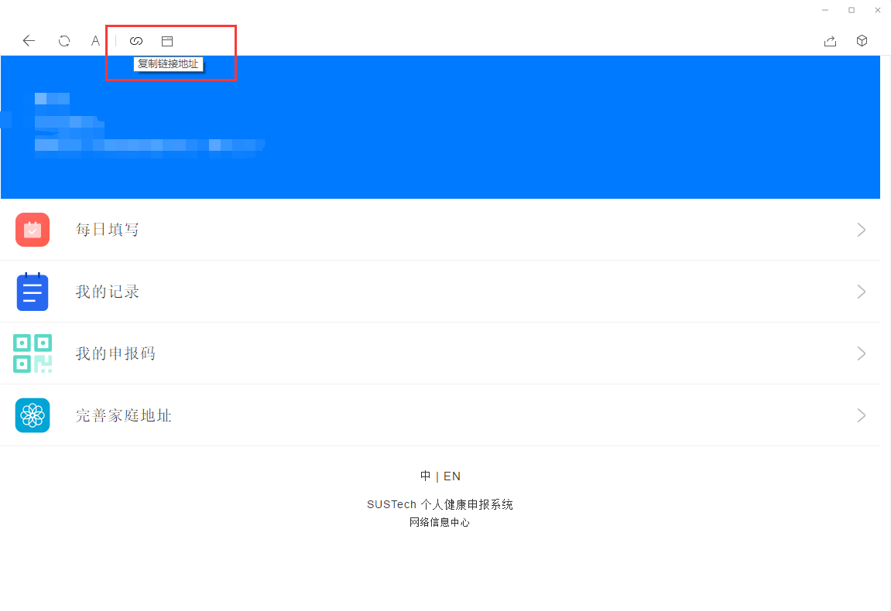

# SUSTech Daily Health Auto Submitter

This is a daily health auto submitter for SUSTech students

## Warning

This program is written for my convenience, and I am not going to responsible for any consequences of using it.

## Requirement

Python 3

## Usage

### Fill the Form

You need to fill the fields in `content.json` and `header.json`

- `content.json`
    - `type`: I believe that 1 is for undergraduate students and 2 is for postgraduate students.
    - `dept`: I don't know the relationship between this field and the department. So I recommand you submit the report on your browser(Chrome/Edge) in develop mode and find this value.

- `header.json`
    - `accessToken`: ITS will change the `accessToken` every day. You can find the newest `accessToken` by copy the link in your Wechat.

    


### Run

```
python submit.py
```